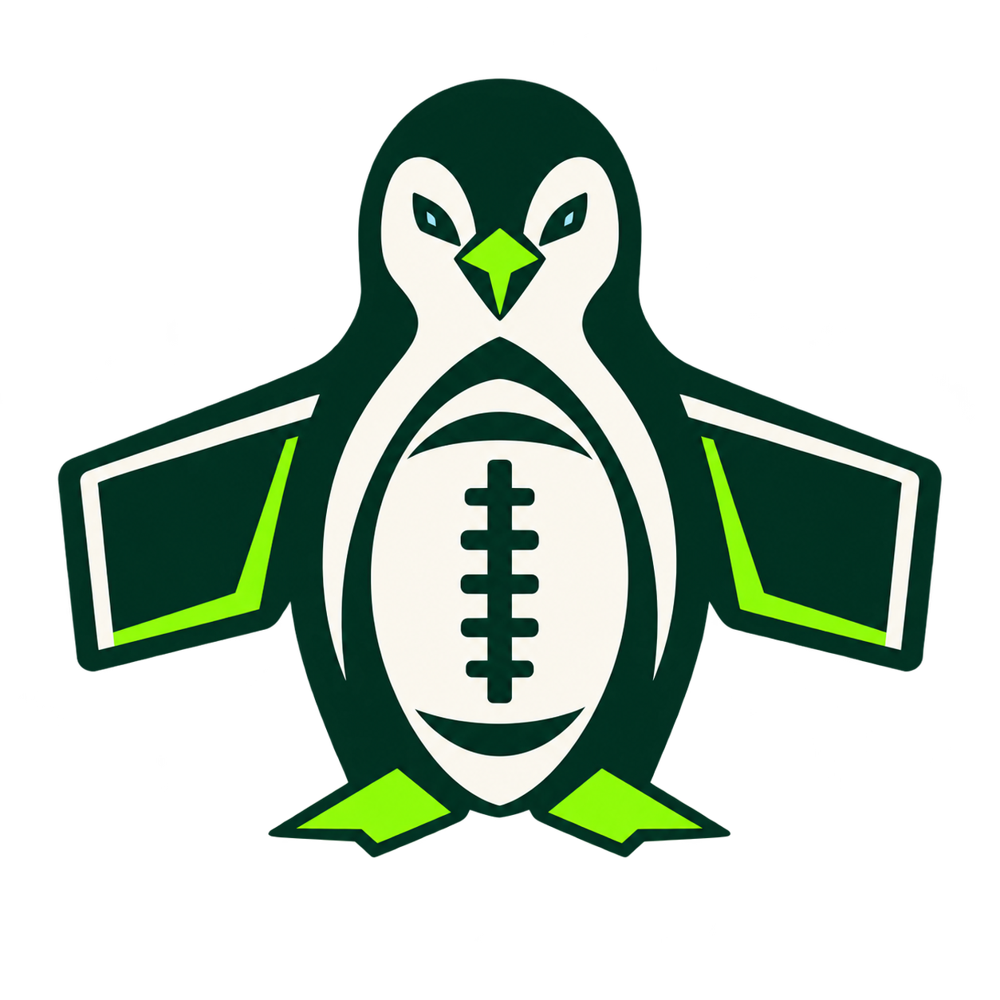

# FieldScreen TV



*Your gameday, on every screen.*

[**Website & install instructions — fieldscreentv.org**](https://fieldscreentv.org)

A television-first sports control room, with NFL, MLB, and MMA. Field positions, a featured game, and configurable video/data panes in one 16:9 screen.

**Development preview · v0.1.0-preview.12.** ESPN scores, schedules, all 32 NFL teams, division standings, game details, and team statistics are connected. nflverse adds advanced season statistics. MLB scores, daily schedules, all 30 teams, live diamonds, standings, wild-card races, and postseason series are connected. IPTV playback, XMLTV guide matching, local recording, scheduled recording, and a saved-video library are included. Favorite teams from NFL and MLB share one live and upcoming games view, with device-local saved selections. UFC and PFL fight cards, numbered events, live bout status, and main-card recording are included. Wireless casting is still planned.

## Steam Deck is the TV console

The Steam Deck runs the same TV experience as a living-room PC: full screen, large-screen composition, and Xbox controller navigation. Screen: Auto fits the built-in Deck panel and switches back to the TV composition on an external display. The Screen control also offers Deck and TV overrides; TV keeps a 16:9 composition. The same dashboard, games, and controller controls remain available in both layouts.

The intended setup is Steam Deck connected to the TV, an Xbox controller, and a Steam library shortcut. Apple TV and Android TV are planned platforms; this release runs on Linux only. Direct launch and Gaming Mode startup have been confirmed on Steam Deck. Automatic dock/undock sizing, external Xbox controllers, and Apple TV still need physical testing.

## Download and launch

Linux preview builds are packaged as an **x64 AppImage**, plus a portable `.tar.gz` alternative. They bundle the runtime, fonts, icons, and preview artwork; Node.js and a development server are not needed to run a packaged download.

[**Download the Linux preview**](https://github.com/AndrewDuval6/fieldscreen-tv/releases/tag/v0.1.0-preview.12)

Choose `FieldScreen-TV-0.1.0-preview.12-Linux-x86_64.AppImage`, or the portable `.tar.gz` alternative.

To launch on Steam Deck:

1. On Steam Deck, switch to Desktop Mode and download the `.AppImage` from Releases.
2. Move it into an `Applications` folder in your Home directory. In its file properties, allow it to run as a program.
3. In Steam, choose **Add a Non-Steam Game**, browse to that AppImage, and add it.
4. Return to Gaming Mode, connect your TV and Xbox controller, and launch the app. Use a standard Gamepad controller layout; this is a native Linux app and does not use Proton. Leave Launch Options empty with preview.12 or later: the packaged launcher handles Steam overlay compatibility and X11 automatically. Turn off Steam Overlay for this shortcut. Set Steam’s Game Resolution to Native for a docked TV; a fixed resolution in Steam can prevent the app from seeing the TV’s real size.

Valve documents adding apps to the Deck library in its [Desktop Mode FAQ](https://help.steampowered.com/en/faqs/view/671A-4453-E8D2-323C).

If AppImage mounting is unavailable on a Linux installation, extract the `.tar.gz` download and add its `fieldscreen-tv` executable to Steam instead.

The AppImage opens full screen for TV use. The installer’s desktop shortcut opens in a window; you can also pass `--windowed` when launching from a terminal. **F11** or the on-screen **Window / Fullscreen** button switches between the two. **Exit** quits the app; if recordings are active or scheduled, it offers to keep running in the background. Closing the window keeps scheduled recordings running and leaves a tray icon to reopen it. Display sleep is inhibited while the window is visible; pending recordings prevent system sleep while the app remains running.

## Controller

| Control | Action |
| --- | --- |
| D-pad / left stick | Move focus between controls |
| A | Activate the focused control; cycle a selected pane's content |
| Left / right on a pane selector | Previous / next content source |
| B | Close the provider/guide panel or introduction; return focus to the view switch |
| X | Select a pane's audio; pin the featured game in Director |
| Y | Change multiview layout; toggle automatic focus in Director |
| LB / RB | Director / Multiview |
| Right stick | Scroll schedules, statistics, scoreboards, or the guide |
| Menu | Refresh scores in Director |

Standard-mapped controllers use the browser Gamepad API. Mouse and keyboard controls also work. Automated tests cover navigation, provider import, stream proxying, guide matching, credential-storage policy, and player reuse; hardware compatibility is not yet verified. Entering provider details may need a keyboard or Steam’s on-screen keyboard.

## Install from a terminal

Clone the repo and run its installer. It downloads the packaged Linux app from GitHub, checks SHA256SUMS, and adds an application-menu shortcut. No Node.js, source build, or administrator access is needed. Git and curl must be available.

```bash
git clone https://github.com/AndrewDuval6/fieldscreen-tv.git &&
cd fieldscreen-tv &&
./install.sh
```

The installed AppImage has a stable path at `~/Applications/FieldScreen-TV.AppImage`. The desktop shortcut opens windowed; adding the AppImage itself to Steam opens the TV experience full screen. Use `./install.sh --no-launch` to install without opening it. Close the running app before updating; from the cloned folder, run `git pull --ff-only && ./install.sh`.

## Follow your favorite teams

Open **★ Favorites**, search across all 32 NFL and 30 MLB teams, and select the teams you follow. Choose **Done** to see their live games, the next seven days of scheduled games, and recent results together. **Watch live** uses your connected IPTV guide to find the broadcast; **Record game** opens the existing recording scheduler. Each game appears once even when you follow both teams, and baseball doubleheaders remain separate games.

Use **Manage teams** to change your choices, or **Follow team** in either league’s Team Lab. Scores refresh every 30 seconds while Favorites is visible. Its schedule remains current when you browse historical dates elsewhere. Desktop selections are saved and verified in the app’s local data folder, independent of its browser address. They survive restarts and do not require an account. The website demo saves its choices only in that browser.

## Connect IPTV and find games

1. Choose **Connect IPTV** in the top bar.
2. Enter an **Xtream** provider address, username, and password, or choose **M3U playlist** and paste its URL/import a file.
3. Add your **XMLTV guide URL** if needed. Xtream guides and guide URLs embedded in M3U headers are detected automatically.
4. Select **Remember this provider** if desired, then **Connect provider**. The app returns to the dashboard and loads the guide in the background.
5. Click a live game tile or **Watch game**. FieldScreen matches the guide and starts the broadcast, briefly checking available feeds when more than one matches.
6. Use **RedZone** beside the screen-layout buttons to open an available RedZone feed in the main pane without changing your layout.

The channel picker is a fallback when the guide cannot confirm coverage. You can also open **TV guide · IPTV** or **Channels** for manual selection: search the whole lineup, choose a destination screen, and select a channel. RedZone availability depends on the provider's current lineup and guide. The expand icon on any pane fills the display with that pane. Use **Back to screens**, **Esc**, or controller **B** to restore the existing layout and audio focus; streams keep their player instances.

**Refresh channels** reloads your M3U URL or Xtream lineup using the current connection, including session-only connections. It updates channel names and groups, adds new channels, removes missing ones, and shows the last successful update time. Channels whose stream URLs stay the same keep playing; removed or changed streams return their panes to the dashboard. A failed refresh keeps the previous lineup. For an imported M3U file, the button asks you to select an updated file; a local file cannot retrieve provider changes by itself. Remembered file imports update their encrypted saved copy.

The guide joins XMLTV programme channel IDs to the playlist's `tvg-id` (or Xtream `epg_channel_id`). XML and compressed feeds are detected from their contents, including short provider links without a file extension. **Your games** automatically ranks live and upcoming NFL, MLB, and MMA coverage across the whole lineup. **Watch game** selects a current guide listing that names both teams; **Check coverage** shows alternatives when only a team, channel name, or scheduled network matches. Network suggestions are marked as unconfirmed. Matching uses text and kickoff times, not video recognition.

**All channels** searches the entire lineup and the next 48 hours of guide listings. **Ctrl+F** focuses this search. Lineups of up to 500 channels appear in one scrollable list; larger lineups are filtered before pagination. **Update TV guide** lets you replace only the guide link while keeping channels connected. Guide refresh runs every 15 minutes and after channel refresh. Download failures keep the last available listings, report the reason, and honor a retry delay.

M3U/XMLTV files can contain account credentials. Enter them only in the app. They are held in the local service for the current session. The packaged Linux app checks encrypted saving and reading on each device before enabling **Remember this provider**. After connecting, the app returns to the dashboard. Select a live game to automatically play its confirmed guide match; the channel picker is a fallback when coverage cannot be confirmed. Multiple confirmed feeds receive a brief media check (2.5-second total budget, recent results reused), with priority retained when response times are similar. Both the playlist and guide are saved together using the OS keyring, and a saved provider reconnects when the app opens. **Check again** retries after unlocking your desktop keyring or wallet. **Remember provider** also saves an already connected session without re-entering links. Plaintext fallback is refused. Browser development sessions do not save provider credentials. **Disconnect & forget** stops playback and removes the saved provider. The app does not send account information to GitHub or an app-operated service; it contacts the provider and the stream/guide servers supplied by that provider.

Standard HTTP HLS and MPEG-TS playback are included, plus browser-compatible MP4/WebM links. Video/audio codecs must be supported by the bundled browser; H.264/AAC is the most broadly compatible combination. DRM-protected streams, UDP/RTSP, proprietary headers, and provider-specific authentication beyond the supplied URL/login are not implemented. A public **Try sample video** option checks a Mux-hosted Big Buck Bunny stream; it is not an NFL broadcast.

Each visible video pane uses a provider connection. Four games normally require four allowed connections and sufficient bandwidth/decoding performance. Moving a game to the main pane preserves its player. Changing to a smaller layout stops hidden streams; selecting another view or disconnecting stops the watch-wall players. Only one video is audible. NFL and MLB scorecards, league scoreboards, and standings remain available alongside live video.

## Record games on your computer

Open **Recordings** in the top bar and choose a storage folder with the system folder picker. FieldScreen verifies that it can write, read, and remove a test file there, and shows available space. The folder choice and recording schedule are remembered locally. No cloud storage or separate recording software is needed.

- **Pause / Go live** appear over live video. Pause uses the player's limited live buffer; it is not unlimited rewind or catch-up.
- **Record** on a live screen saves that channel. Choose a duration, then start. Recording continues when you switch sports or change panes. Open **Recordings** to stop it early.
- **Record game** in NFL/MLB schedules or game details saves a future recording. It starts two minutes before the listed game time and searches your XMLTV guide for both teams. Unavailable coverage is retried for up to 30 minutes, then marked missed. Use a remembered provider for recordings after an app restart.
- **Recordings** holds scheduled, active, saved, partial, and failed entries. Play saved games inside the app, seek with the timeline or 30-second controls, open their folder, or explicitly delete a video and its entry.

Keep the computer powered on, online, and FieldScreen running. Closing the window keeps pending recordings running in the tray; fully quitting or shutting down stops recording. This preview does not wake a powered-off computer or launch itself after a reboot. Saved start times are fixed: cancel and schedule again if the league changes the game time. Choose enough duration for overtime or extra innings.

Up to two recordings can run together, subject to the provider's connection allowance. Each recording uses an additional connection beyond live viewing. Space is checked before recording and while it runs; the recorder stops if available space drops below 1 GB. Changing the folder affects new recordings; existing scheduled jobs retain their original folder. Partial video is retained when possible after interruption.

Recordings are fragmented MP4 files with the original video and AAC audio. HLS and MPEG-TS inputs are tested with generated media, including extensionless HLS addresses. Video compatibility still depends on the provider's codec and this device's playback support. Recording starts at connection time; earlier footage cannot be recovered. Physical Steam Deck testing and recording an entire live sports broadcast are still pending.

## Baseball

Use the **NFL / MLB / MMA** selector in the top bar to switch sports. Your last sport is remembered on this device. All three sports share your saved IPTV provider, guide, fullscreen controls, and multiview. Choose NFL or MLB scorecards, MMA fight cards, or event boards individually in each pane.

**Baseball Director** prioritizes live games, close late innings, and bases-loaded situations. The diamond shows reported occupied bases, batter, pitcher, balls, strikes, and outs. Between innings and after a final, stale runners and counts are hidden. Fields are schematic, not player tracking. **Game details** adds inning scoring, runs/hits/errors, latest at-bats, game batting statistics, and the current pitcher's pitch count when reported.

**Schedule** browses daily games. Today retains games still live from the previous day after midnight Eastern. **Standings** includes all six divisions, AL/NL selection, wild-card races, games back, run differential, and last-ten records. **Teams** offers hitting, pitching, and fielding season statistics. **Postseason** groups MLB's published games into series and rounds, keeps placeholder teams and times marked TBD, and identifies games that are only needed if a series continues. Series wins count completed games; no projected matchups are presented as confirmed.

MLB scores and open game details refresh every 30 seconds while visible. Standings and team statistics are cached for five minutes; postseason schedules for one minute. Failures keep the last successful update with a cached indicator. The [MLB Stats API](https://statsapi.mlb.com/api/v1/schedule?sportId=1) currently provides publicly reachable data without a key. It is not an availability guarantee or a grant of redistribution rights. Provider credentials and guide contents stay local and are not sent to MLB. Data may lag video.

The same **Watch game** action checks both teams and the event time against XMLTV before streaming. It rejects explicitly wrong-sport listings, replays, and the wrong game number when a doubleheader is labeled. Team channels without a confirmed current guide match remain suggestions.

## NFL data

The dashboard starts on the current NFL week. **Game Day** automatically focuses live games, prioritizing red-zone possessions and close fourth quarters; before kickoff, it features the next scheduled game. You can pin any matchup and page through the field wall. Scheduled games show kickoff time and no invented score. Field markers appear only when ESPN reports a recognizable possession and position, with offense moving left to right.

**Schedule** selects a season, stage, and week. **Game details** includes quarter scores, team statistics, recent/scoring plays, and player leaders when published. **Standings** covers all eight divisions. **Team Lab** offers all 32 teams, season/category selection, and advanced nflverse statistics. Before the first game, Team Lab defaults to the previous season; each statistics panel identifies its season.

Scores and open game details refresh every 30 seconds while the page is visible. Standings refresh every 10 minutes; team statistics are cached for 30 minutes and nflverse season totals for six hours. Failed requests retain the last successful response and label it **CACHED** with its original timestamp. Data can lag the broadcast. Postponements, missing statistics, and unpublished seasons are shown as unavailable rather than filled with sample numbers.

Sources:

- [ESPN scoreboard](https://site.api.espn.com/apis/site/v2/sports/football/nfl/scoreboard), [teams](https://site.api.espn.com/apis/site/v2/sports/football/nfl/teams), and [standings](https://site.api.espn.com/apis/v2/sports/football/nfl/standings?level=3), plus ESPN game summaries and team statistics. These publicly reachable endpoints currently require no API key but are undocumented and unsupported for this app. Availability and response formats can change; access is not a production service guarantee or a redistribution license.
- [nflverse data](https://github.com/nflverse/nflverse-data), used under [CC BY 4.0](https://creativecommons.org/licenses/by/4.0/). FieldScreen selects, normalizes, and rounds team regular-season statistics for display. Consult the [update schedule](https://nflreadr.nflverse.com/articles/nflverse_data_schedule.html): advanced statistics are published after games, not a live feed. A new season file may not yet exist.

The installed app retrieves and caches data locally. IPTV guide contents and provider credentials are never sent to ESPN or nflverse. NFL data access does not include a video broadcast; streams come from the provider you connect.

## Included in the preview

- Sunday Director with real NFL data, automatic focus, manual pinning, and a paged field wall.
- Detailed proportioned fields with home-team end zones, yard numbers, NFL hash marks, and reported possession markers.
- Schedules, eight-division standings, game details, and all 32 teams with historical season statistics.
- nflverse advanced metrics, including EPA, CPOE, air yards, sacks, and QB hits where published.
- Full-screen, split, four-pane, and one-plus-three layouts mixing IPTV, NFL, MLB, and MMA data.
- M3U URL/file import, Xtream login, XMLTV matching, team/channel search, and now/next listings.
- Matchup-to-guide broadcast discovery and real single-pane audio focus.
- Live play/pause, local MP4 recording, scheduled NFL/MLB games and MMA main-card recordings, and a saved-game library.
- Stadium and Night themes, branded connection loaders, and reduced-motion support.

## Still to build

Saved layouts, casting, additional TV platforms, and hardware verification. The Yahoo fantasy companion remains a separate project.

Do not add IPTV credentials, playlist URLs containing credentials, or API secrets to the source or GitHub issues. Use the private in-app setup for credentials. Your actual provider and physical Steam Deck/TV playback have not yet been verified.

## Development

Requires Node.js 24 or later and npm.

```sh
npm ci
npm run build:recorder
npm test
npm run desktop
```

Building the recorder needs Python 3.12+, GCC, make, binutils, and xz on Linux x86-64. The build script verifies source checksums and builds a static executable; system FFmpeg is used only to generate test fixtures.

For the browser version, run `npm run dev -- --host 127.0.0.1`. For a Linux download, run `npm run package:linux`. Built packages appear in `release/`. See [preview security scope](SECURITY.md) before using the browser development entry.

`design/tv-preview.html` preserves the approved visual study. `scripts/build-preview.mjs` produces its TV application and bundles the local sports data and IPTV services. `desktop/` provides the sandboxed Electron shell. `app/` retains the React/Vinext entry point for the full dashboard implementation. The Linux workflow checks the browser build and packages the desktop preview.

## Artwork and dependencies

The penguin/football emblem and stadium backdrop are original generated artwork. The backdrop is not a photograph of a live game. The logo was created with the built-in image generator; its [prompt](design/logo-prompt.txt) is included for provenance. Field diagrams use reported NFL positions; they are schematic views, not player-tracking data. Fonts are distributed under the licenses included with their packages. Icons come from Lucide. Video playback uses [hls.js](https://github.com/video-dev/hls.js) and [mpegts.js](https://github.com/xqq/mpegts.js); XMLTV parsing uses [saxes](https://github.com/lddubeau/saxes). Their licenses are included in the package. Recording uses a separate [FFmpeg](https://ffmpeg.org/) executable (LGPL 2.1 or later) with [musl](https://musl.libc.org/) (MIT). Their notices and licenses are bundled. Complete unmodified sources and the build script are provided as `FieldScreen-Recorder-Sources-8.1.2.tar.gz` alongside every recording-enabled release. Extract it and run `python3 build-recorder.py --source-dir . --output ./recorder` to rebuild offline; the portable app allows replacing `resources/recorder/ffmpeg`. Third-party dependencies retain their respective licenses. This is an independent fan project, not an official NFL, MLB, or Yahoo product.

The source is published for inspection and download. An open-source license for the project has not been selected; third-party licenses still apply.


## MMA fight nights

Choose **MMA** in the sport selector for UFC and PFL schedules, full fight cards, fighter records, live bout status and recent results. Search by event or any fighter on a card. The event calendar includes numbered events and PPV listings when the data source identifies them as PPV; a numbered event alone does not imply a PPV purchase. The schedule covers the previous seven days and the next 120 days, with source availability shown explicitly.

With your IPTV provider and XMLTV guide connected, **Watch live** matches the event number or both fighters in the current guide, then uses the same fast stream selection as football and baseball. Unknown coverage opens the channel chooser. MMA cards and the event board can share Multiview with NFL, MLB, and live streams.

**Record main card** schedules the later card session when separate preliminary times are listed; otherwise **Record event** uses the event start. The default MMA recording length is six hours and can be changed. Each recording captures one channel; prelims on a different channel require a separate recording. Keep the device online and FieldScreen running. Reschedule if the promotion changes the event time. Fight results and session times come from ESPN and may lag the broadcast; bout order can change. Provider subscriptions and event purchases are separate.

NHL hockey is planned for **September 29, 2026**, the announced [2026–27 NHL opening night](https://www.nhl.com/news/nhl-announces-2026-27-regular-season-schedule). Hockey is not included in this preview. FieldScreen’s longer-term direction is every sport in one TV experience.
